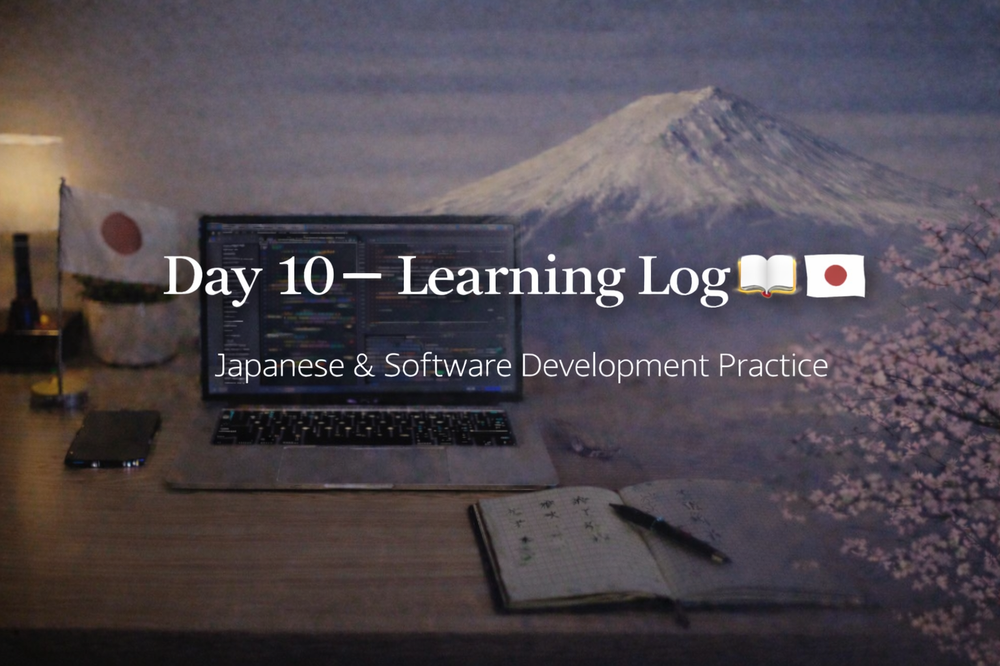

<!-- ===================== -->
<!-- 🌟 DAY 10 BANNER 🌟 -->
<!-- ===================== -->

---

# 🚀 Day 10 — Learning Log 📘 🇯🇵💻  
📅 Date: Day 10  
🔥 Current Streak: 10 days  
🏆 Longest Streak: 10 days  

---

## 💻 Software Development

### 🧠 Exam-Oriented Revision (C Programming)
- Revised **C programming concepts** from college syllabus
- Focused on:
  - Core syntax & logic
  - Control flow
  - Functions and memory basics
- Revision aligned with **upcoming exams**
- Prioritized clarity and recall over new topics

📌 Goal today: strengthen fundamentals, not rush ahead

---

## 🇯🇵 Japanese Language — Daily Practice

### 🔁 Kanji Revision
- Revised **14 Kanji**
- Focused on:
  - Meaning recall
  - Readings
  - Usage recognition
- Details shared separately on **Discord for revision**

---

## 🎧 Japanese Listening
- Completed listening practice
- Used natural Japanese content
- Focused on:
  - Flow
  - Pronunciation
  - Sentence endings
- Goal: understand meaning without translating word-by-word

---

## 🌏 Japan × Career Learning

Learned about **OJT (On-the-Job Training)** in Japanese workplaces.  
Juniors are trained through real tasks, close guidance from seniors, and gradual responsibility instead of formal classroom-style training.

---

## 🧠 Reflection
Day 10 was about **discipline over intensity**.

- Balanced exam prep with consistency
- Maintained Japanese learning even on a revision-heavy day
- Streak reached **10 days** — momentum feels real

Showing up matters more than doing everything.

---

## 📌 Next Up (Day 11)
- Resume software practice after exams
- Continue Kanji revision + output
- Listening with higher difficulty
- Maintain streak 🔥
