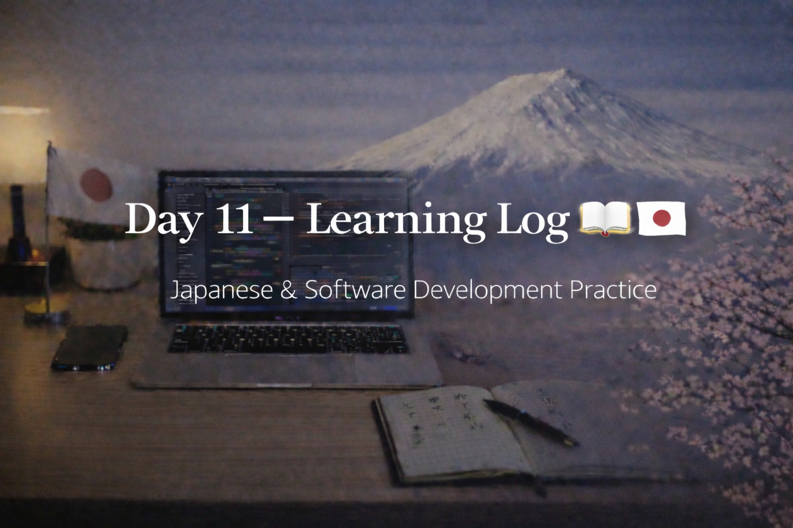

<!-- ===================== -->
<!-- 🌟 DAY 11 BANNER 🌟 -->
<!-- ===================== -->

---

# 🚀 Day 11 — Learning Log 📘 🇯🇵  
📅 Date: Day 11  
🔥 Current Streak: 11 days  
🏁 Longest Streak: 11 days  

---

## 💻 Software Development

- Revised **C Programming** concepts from college syllabus for upcoming exams
- Focused on:
  - Core syntax and fundamentals
  - Logic flow and problem understanding
  - Strengthening exam confidence instead of rushing ahead
- Goal today: **clarity > coverage**

---

## 🇯🇵 Japanese Language

- Revised **4 Kanji** for recall and long-term retention
- Focused on:
  - Meanings
  - Readings
  - Familiarity through repetition
- Light but consistent progress maintained

---

## 🎧 Listening Practice
- Japanese listening session completed
- Focused on:
  - Natural flow
  - Familiar words in real context
- Goal: understanding without translating mentally

---

## 🌏 Japan × Career Learning

- Learned about **Nemawashi (根回し)** in Japanese workplaces
- Understood how informal consensus-building happens *before* meetings to ensure smooth decisions

---

## 🤝 Networking
- Stayed active in Japan-focused learning communities
- Observing communication styles and professional expectations

---

## 🧠 Reflection

Day 11 was about **balance during exam preparation**:
- Didn’t skip learning despite exams
- Prioritized revision over new content
- Consistency stayed intact even on a lighter day

Small steps. Still moving forward.

---

## 📌 Next Up (Day 12)
- Continue exam-focused software revision
- More Kanji recall
- Listening with higher attention
- Maintain streak 🔥
