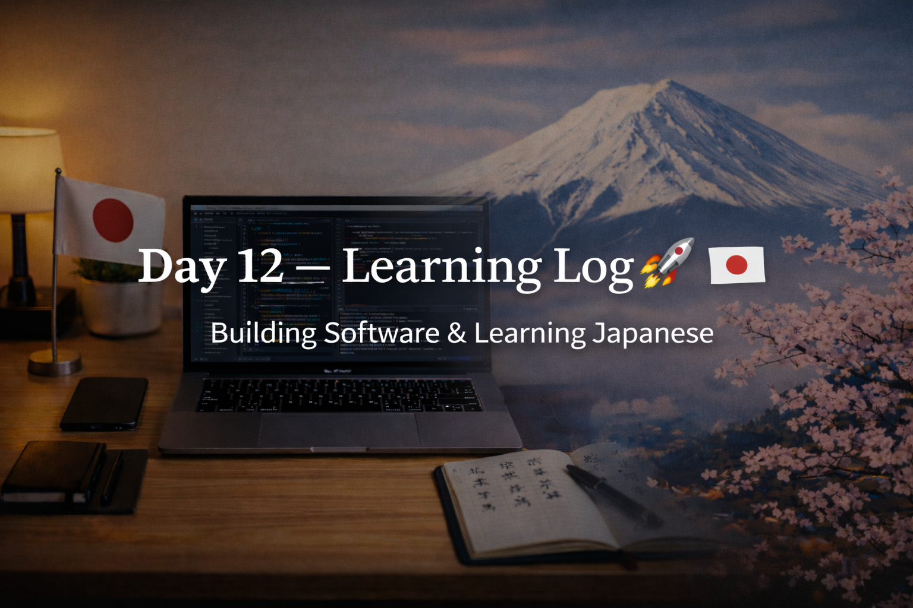

<!-- ===================== -->
<!-- 🌟 DAY 12 BANNER 🌟 -->
<!-- ===================== -->

---

# 🚀 Day 12 — Learning Log 📘 🇯🇵💻  
📅 Date: Day 12  
🔥 Current Streak: 12 days  
🏆 Longest Streak: 12 days  

---

## 💻 Software Development

- Revised **C Programming** concepts from college syllabus for exams  
- Focused on strengthening fundamentals and clarity  
- Studied **how websites are hosted using GitHub Pages**
  - How static sites are deployed
  - How custom domains are connected to GitHub Pages
- Learned **AWS basics**:
  - What AWS is
  - Why cloud platforms are used
  - High-level understanding of how services work together
- Updated **GitHub profile README.md**:
  - Added GitHub stats visuals
  - Added most-used languages section
  - Improved profile presentation and clarity
- Today was **theory-focused**, no hands-on deployment

---

## 🇯🇵 Japanese Language

- Revised **8 Kanji** for recall and retention  
- Focused on:
  - Meanings
  - Readings
  - Recognition in context
- Detailed Kanji breakdown shared separately on **Discord**

---

## 🎧 Listening Practice
- Japanese listening practice completed  
- Focused on:
  - Natural speech flow
  - Familiar vocabulary in real context  
- Goal: gradual improvement without forcing speed

---

## 🌏 Japan × Career Learning

Learned about **Senpai–Kohai (先輩・後輩) culture** in Japanese workplaces.  
Juniors are expected to observe, learn patiently, and improve steadily, while seniors guide, support, and take responsibility for juniors’ growth.

---

## 🧠 Reflection

Day 12 was about **understanding systems**, not just using them.

- Software learning expanded into how things work on the internet
- GitHub profile now reflects progress more clearly
- Japanese learning stayed consistent
- Cultural understanding of Japan deepened alongside technical skills

Progress continues, one disciplined day at a time.

---

## 📌 Next Up (Day 13)
- Resume practical software work
- More Kanji revision + sentence usage
- Continue listening practice
- Maintain streak 🔥
