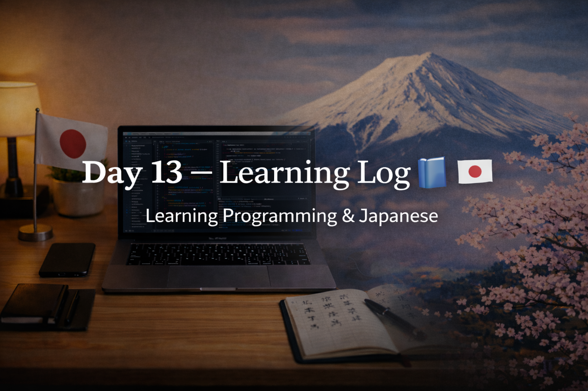

<!-- ===================== -->
<!-- 🌟 DAY 13 BANNER 🌟 -->
<!-- ===================== -->

---

# 🚀 Day 13 — Learning Log 📘 🇯🇵💻  
📅 Date: Day 13  
🔥 Current Streak: 13 days  
🏆 Longest Streak: 13 days  

---

## 💻 Software Development

- Learned about **different types of programming languages**:
  - Low-level languages
  - High-level / human-readable languages
  - Why abstraction levels matter
- Studied **Linux Operating System**:
  - What Linux is
  - Why developers prefer Linux
  - Advantages over other operating systems
  - Different types (distributions) of Linux
- Planning to **set up Linux** in the near future
- Learning today was **conceptual and foundational**, not implementation-focused

---

## 🇯🇵 Japanese Language

- Revised **6 Kanji** today
- Focused on:
  - Meanings
  - Readings
  - Recognition through repetition
- Detailed Kanji explanations and examples shared separately on **Discord**

---

## 🎧 Listening Practice
- Japanese listening practice completed
- Focused on:
  - Familiar vocabulary
  - Natural sentence flow
- Goal: gradual improvement without pressure

---

## 🌏 Japan × Career Learning

Learned about **generalist-first career paths** in Japanese companies.  
Fresh graduates often rotate across teams early to understand the company as a whole before specializing later.

---

## 🧠 Reflection

Day 13 focused on **understanding systems**, not rushing execution.

- Software learning broadened perspective
- Linux exploration aligned with long-term developer goals
- Japanese learning stayed consistent
- Cultural understanding of Japanese careers deepened

Slow, steady, and intentional progress.

---

## 📌 Next Up (Day 14)
- Continue software fundamentals
- More Kanji revision + sentence usage
- Listening practice
- Maintain streak 🔥
