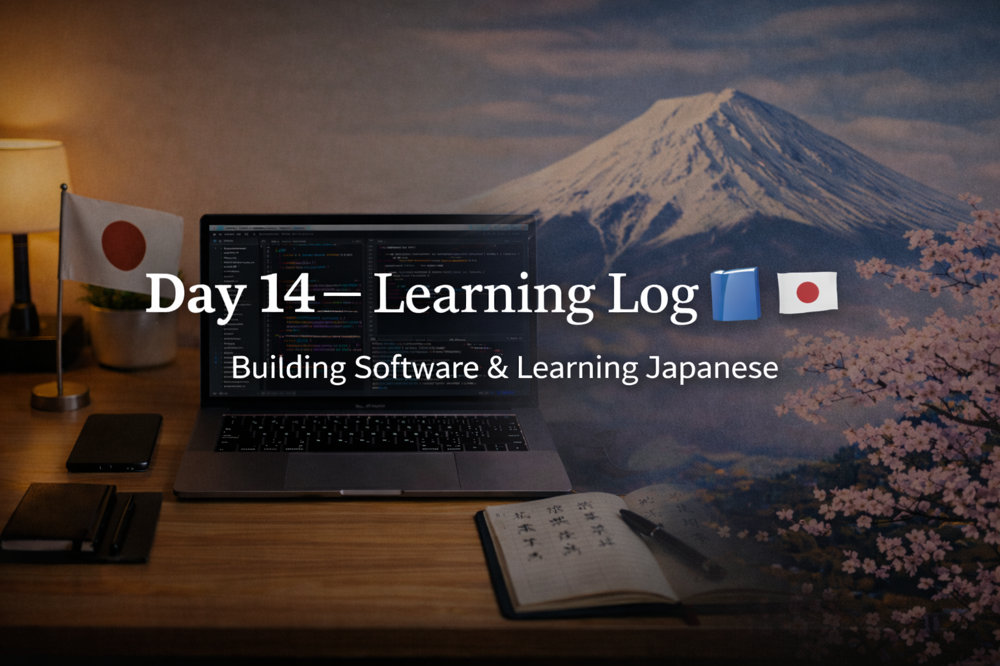

<!-- ===================== -->
<!-- 🌟 DAY 14 BANNER 🌟 -->
<!-- ===================== -->

---

# 🚀 Day 14 — Learning Log 📘 🇯🇵💻  
📅 Date: Day 14  
🔥 Current Streak: 14 days  
🏆 Longest Streak: 14 days  

---

## 💻 Software Development

- Revised **C Programming** from college syllabus (Week 2 start)
- Focused on:
  - Core concepts and logic
  - Syntax clarity for exams
  - Strengthening fundamentals instead of rushing ahead
- Today’s focus was **revision and reinforcement**, not new implementation

---

## 🇯🇵 Japanese Language

- Revised **6 Kanji** today
- Focused on:
  - Meanings
  - Readings
  - Usage in simple sentences
- Detailed Kanji explanations and examples shared separately on **Discord**

---

## 🎧 Listening Practice
- Japanese listening practice completed
- Focused on:
  - Natural pronunciation
  - Familiar vocabulary
- Goal: steady improvement without pressure

---

## 🌏 Japan × Career Learning

Learned about **Kaizen (改善)** in Japanese workplaces.  
Japanese companies value continuous, small improvements made daily instead of sudden big changes, which aligns with long-term consistency and discipline.

---

## 🧠 Reflection

Day 14 marked the **start of Week 2** with a clear mindset.

- Software fundamentals stayed strong
- Japanese learning remained consistent
- Career learning reinforced the importance of gradual growth

Progress is quiet, but it compounds.

---

## 📌 Next Up (Day 15)
- Continue C programming revision
- More Kanji recall
- Listening practice
- Maintain streak 🔥
