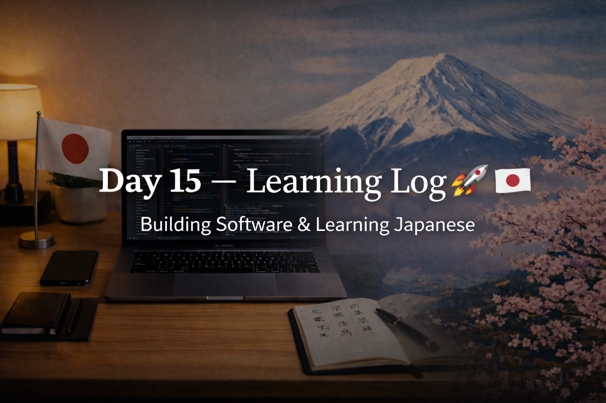

<!-- ===================== -->
<!-- 🌟 DAY 15 BANNER 🌟 -->
<!-- ===================== -->

---

# 🚀 Day 15 — Learning Log 📘🇯🇵  
📅 Date: Day 15  
🔥 Current Streak: 15 days  
🏁 Longest Streak: 15 days  

---

## 💻 Software Development

- Learned about **Linux in depth**, with focus on:
  - What **Arch Linux** is
  - How Linux differs from Windows (design philosophy, control, performance)
  - Why Linux knowledge is important for programmers
- Understood how Linux strengthens:
  - System-level thinking
  - Debugging skills
  - Software fundamentals
- Continued revising **C Programming** from college syllabus
- Focused on exam-oriented clarity and fundamentals (exam tomorrow)

---

## 🇯🇵 Japanese Language — Kanji Revision (12)

- Revised **12 Kanji** today
- Focused on:
  - Meanings
  - Readings
  - Recall through repetition
- Goal: strengthen long-term retention, not rush new Kanji

---

## 🎧 Listening Practice

- Completed Japanese listening practice
- Focused on:
  - Natural flow
  - Understanding context without translating word-by-word

---

## 🌏 Japan × Career Learning

- Learned why Japanese companies prefer **generalist engineers**
- Early-career engineers are expected to:
  - Understand systems broadly
  - Learn OS basics, Linux, and fundamentals
  - Rotate tasks to build wide foundations
- Reinforced why strong fundamentals matter more than tools

---

## 🤝 Networking

- Maintained consistency in long-term networking mindset
- Focused on learning culture before pitching skills

---

## 🧠 Reflection

Day 15 reinforced something important:

- Fundamentals > tools
- Systems thinking > shortcuts
- Consistency > motivation

Studying Linux + C aligns well with how Japanese engineering culture trains juniors.

---

## 📌 Next Up (Day 16)
- Post-exam lighter coding
- Continue Kanji revision
- Listening + reading
- Maintain streak 🔥
