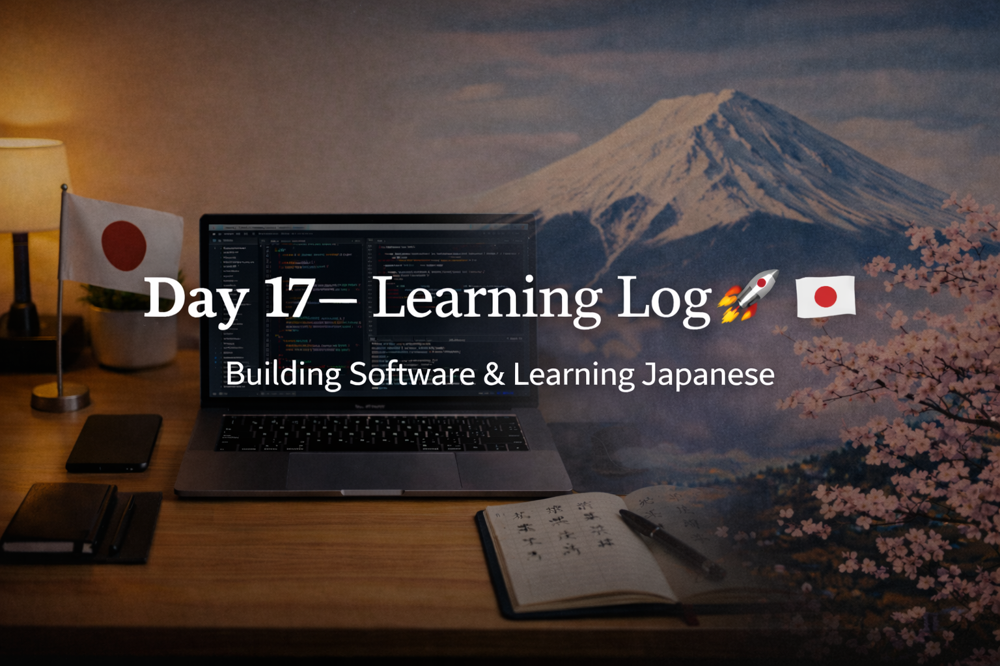

<!-- ===================== -->
<!-- 🌟 DAY 17 BANNER 🌟 -->
<!-- ===================== -->

---

# 🚀 Day 17 — Learning Log 📘🇯🇵  
📅 Date: Day 17  
🔥 Current Streak: 17 days  
🏁 Longest Streak: 17 days  

---

## 💻 Software Development

### 🧪 Post-Exam Practice & Verification
- Practiced **questions asked in the Programming exam** on VS Code
- Ran all programs successfully
- Re-checked logic step by step
- Cross-verified outputs with expected answers
- Focused on understanding *why* the solution works, not just getting it right

This reinforced confidence in fundamentals and execution.

---

## 🇯🇵 Japanese Language — Kanji Revision

Focused on **recall + clarity**, keeping things light but consistent.

### 🔁 Kanji Revised (5)

- **者** — someone, person  
  Readings: シャ / もの  

- **不** — negative, non-, bad  
  Readings: フ / ブ  

- **北** — north  
  Readings: ホク / きた  

- **民** — people, nation  
  Readings: ミン / たみ  

- **動** — move, motion, change  
  Readings: ドウ / うごく / うごかす  

---

## 🎧 Listening
- Light Japanese listening practice completed
- Focused on flow and sentence rhythm

---

## 🌏 Japan × Career Learning

- Learned why **self-verification** is highly valued in Japanese workplaces
- Engineers are expected to:
  - Test their own work
  - Re-run and validate logic before submission
  - Take responsibility for correctness
- Accuracy and accountability build trust faster than speed

Today’s software practice matched this mindset perfectly.

---

## 🧠 Reflection

Day 17 was about **discipline and responsibility**.

- Rechecking work built confidence
- No rushing, just clarity
- Consistency stayed intact even on lighter days

Quiet progress is still progress.

---

## 📌 Next Up (Day 18)
- Continue light coding practice
- Kanji revision + usage
- Listening with more attention
- Maintain streak 🔥
