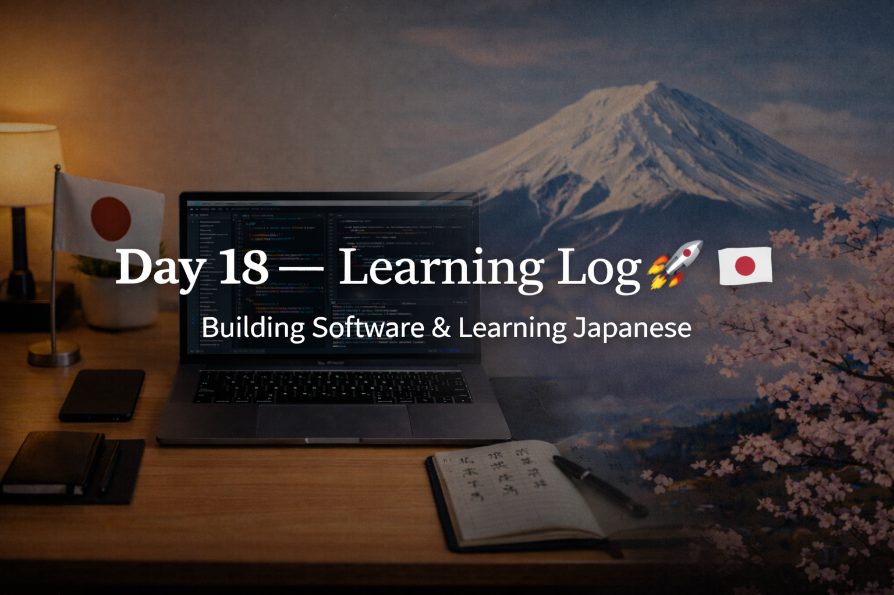

<!-- ===================== -->
<!-- 🌟 DAY 18 BANNER 🌟 -->
<!-- ===================== -->

---

# 🚀 Day 18 — Learning Log 📘🇯🇵  
📅 Date: Day 18  
🔥 Current Streak: 18 days  
🏁 Longest Streak: 18 days  

---

## 💻 Software Development

### 🔵 C Programming Practice
- Added **3 C programs** to my programming practice repository:
  - Palindrome check
  - Positive / Negative / Zero check
  - Array sorting
- Wrote and tested all programs in **VS Code**
- Focused on:
  - Correct logic
  - Clean structure
  - Proper input/output handling
- Updated the **README.md** of the programming-practice repo to be:
  - Language-agnostic
  - Stable and long-term (no frequent updates needed)

📂 Programming Practice Repo (C section):  
👉 https://github.com/aryan-devv/programming-practice/tree/main/C  

---

## 🇯🇵 Japanese Language — Kanji Revision

Revised **5 Kanji** today with focus on meanings, readings, and recall.

- **休** — rest, take a break, sleep  
- **通** — pass through, commute  
- **年** — year, counter for years  
- **入** — enter, insert  
- **明** — bright, light, clear  

Focused on long-term retention rather than speed.

---

## 🎧 Listening Practice
- Completed Japanese listening practice
- Focused on:
  - Natural sentence flow
  - Context-based understanding

---

## 🌏 Japan × Career Learning

- Learned why **rest is considered part of professionalism** in Japan
- Japanese work culture values:
  - Sustainable performance
  - Accuracy over exhaustion
  - Responsibility to return reliable results
- Rest is seen as maintaining quality, not avoiding work

---

## 🧠 Reflection

Day 18 was balanced and grounded.

- Software practice stayed consistent
- Kanji revision stayed light but effective
- Career learning reinforced long-term thinking

No rush. No burnout.  
Just steady progress.

---

## 📌 Next Up (Day 19)
- Continue C programming practice
- Kanji revision + sentence usage
- Listening with higher attention
- Maintain streak 🔥
