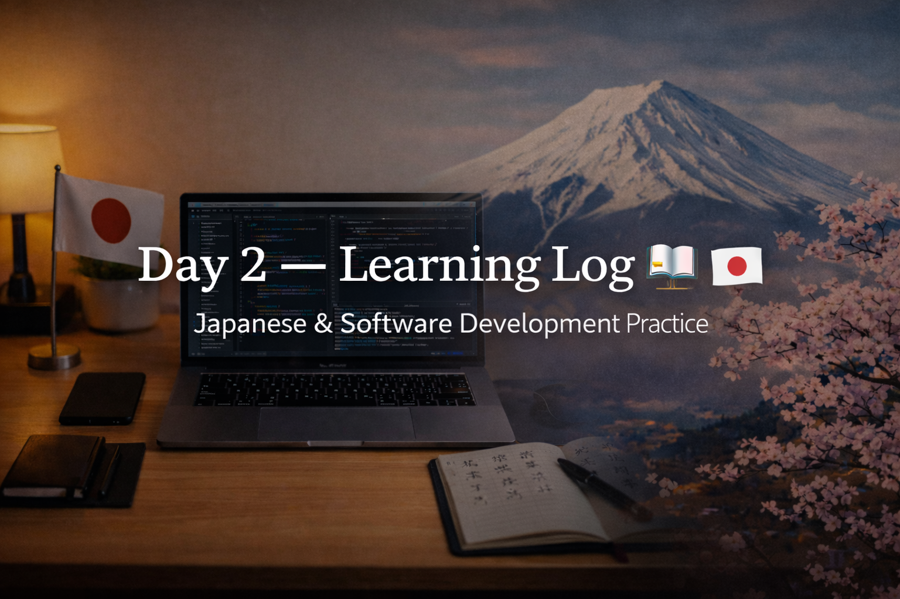

<!-- ===================== -->
<!-- 🌟 DAY 2 BANNER 🌟 -->
<!-- ===================== -->

---

# 🚀 Day 2 — Learning Log 🇯🇵💻  
📅 Date: Day 2  
🔥 Current Streak: 2 days  
🏁 Longest Streak: 2 days  

---

## 💻 Software Development

### 🧠 Programming Practice Repository
- Created and structured **`programming-practice`** repository
- Designed for **multi-language learning** (starting with Python)
- Practiced core software fundamentals:
  - Arrays (lists)
  - Strings
  - Functions
- Focused on logic, readability, and consistency
- Added multiple problem solutions with clean commits

🔗 Repo: https://github.com/aryan-devv/programming-practice  

---

### 🌐 Portfolio Website
- Continued work on personal **portfolio website**
- Live site deployed and accessible
- Repository linked and maintained
- Marked as *work in progress* intentionally

🔗 Live: https://aryan-portfolio-eight.vercel.app/  
📂 Repo: https://github.com/aryan-devv/aryan-portfolio  

---

### 🧩 GitHub Profile
- Updated main **GitHub profile README**
- Added:
  - Neon design
  - Featured project cards
  - Honest skill representation
- Ensured all visuals and stats are stable and recruiter-safe

---

## 🇯🇵 Japanese Language — Kanji Study (10)

Focused on **meaning, readings, and usage**.

### 1️⃣ 同  
- **Meaning:** same, agree  
- **Readings:** on / dō  
- **Example:**  
  - 同じ考えです。  
    *(Onaji kangae desu — I have the same idea.)*

---

### 2️⃣ 事  
- **Meaning:** matter, thing, fact, business  
- **Readings:** ji / koto  
- **Example:**  
  - 大切な事です。  
    *(Taisetsu na koto desu — It’s an important matter.)*

---

### 3️⃣ 自  
- **Meaning:** oneself, self  
- **Readings:** ji / shi / mizuka  
- **Example:**  
  - 自分でします。  
    *(Jibun de shimasu — I will do it myself.)*

---

### 4️⃣ 民  
- **Meaning:** people, nation, citizens  
- **Readings:** min / tami  
- **Example:**  
  - 国民の意見。  
    *(Kokumin no iken — Opinion of the people.)*

---

### 5️⃣ 発  
- **Meaning:** departure, discharge, publish, emit  
- **Readings:** hatsu / hotsu  
- **Example:**  
  - 東京発の電車。  
    *(Tōkyō hatsu no densha — A train departing from Tokyo.)*

---

### 6️⃣ 者  
- **Meaning:** person, someone  
- **Readings:** sha / mono  
- **Example:**  
  - 学生者ではありません。  
    *(Gakusei-sha de wa arimasen — Not a student.)*

---

### 7️⃣ 地  
- **Meaning:** ground, earth, land  
- **Readings:** chi / ji  
- **Example:**  
  - 地図を見ます。  
    *(Chizu o mimasu — I look at the map.)*

---

### 8️⃣ 合  
- **Meaning:** fit, suit, join  
- **Readings:** gō / au / awasu  
- **Example:**  
  - 意見が合う。  
    *(Iken ga au — Opinions match.)*

---

### 9️⃣ 市  
- **Meaning:** city, market  
- **Readings:** shi / ichi  
- **Example:**  
  - 大きな市です。  
    *(Ōkina shi desu — It’s a big city.)*

---

### 🔟 業  
- **Meaning:** business, vocation, work, performance  
- **Readings:** gyō / gō  
- **Example:**  
  - IT業界で働く。  
    *(IT gyōkai de hataraku — Work in the IT industry.)*

---

## 🎧 Japanese Listening
- Completed **15 minutes of Japanese listening practice**
- Focused on natural pronunciation and sentence flow
- Goal: improve comprehension without subtitles

---

## 🌐 Networking
- Connected with **one Japanese professional on LinkedIn**
- Intention: cultural exposure, language motivation, long-term networking

---

## 🧠 Reflection
Today was about **depth and expansion**:
- Strengthened software fundamentals
- Deepened Kanji knowledge with real usage
- Improved GitHub presence
- Took a real-world step toward Japan through networking

Progress feels **real**, not theoretical.
