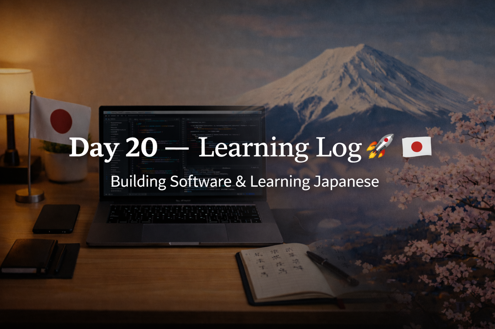

<!-- ===================== -->
<!-- 🌟 DAY 20 BANNER 🌟 -->
<!-- ===================== -->

---

# 🚀 Day 20 — Learning Log 📘🇯🇵  
📅 Date: Day 20  
🔥 Current Streak: 20 days  
🏆 Longest Streak: 20 days  

---

## 💻 Software Development

### 🧠 Programming Practice (C)
- Uploaded **3 new C programs** to `programming-practice`:
  - Count digits in a number
  - Sum of digits
  - Find smallest element in an array
- Began **thinking from a DSA point of view** instead of just writing code
- Focused on:
  - Step-by-step logic
  - Edge cases
  - Clean problem breakdown

📂 Repo (C Programs):  
👉 https://github.com/aryan-devv/programming-practice/tree/main/C

---

## 🇯🇵 Japanese Language — Kanji Revision

- Revised **6 Kanji** today
- Focused on:
  - Meaning recall
  - Reading confidence
  - Long-term retention
- Details documented separately for Discord Kanji posts

---

## 🎧 Japanese Listening
- Listening practice completed
- Focused on:
  - Natural flow
  - Sentence rhythm
  - Overall comprehension

---

## 🌏 Japan × Career Learning

### 🧠 Thinking Before Coding (Japanese Engineering Mindset)
Japanese engineers strongly value:
- Planning logic before writing code
- Manual dry-runs and reasoning
- Minimizing rework through clear thinking

This aligns directly with:
- DSA-style problem solving
- Algorithm-first mindset
- Writing fewer but higher-quality lines of code

---

## 🧠 Reflection
Day 20 marked a **shift in mindset**.

- Coding felt more intentional
- Logic came before syntax
- Japanese study stayed consistent
- Progress felt calm, not rushed

Thinking like an engineer > typing fast.

---

## 📌 Next Up (Day 21)
- More DSA-oriented problems
- Continued Kanji revision
- Listening + consistency
- Maintain streak 🔥
