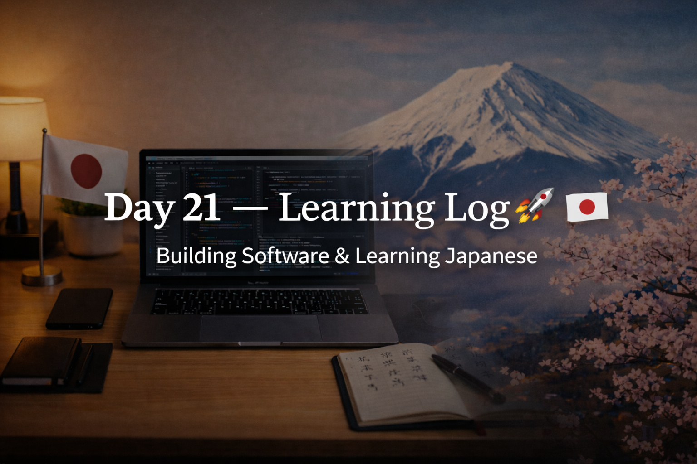

<!-- ===================== -->
<!-- 🌟 DAY 21 BANNER 🌟 -->
<!-- ===================== -->

---

# 🚀 Day 21 — Learning Log 📘🇯🇵  
📅 Date: Day 21  
🔥 Current Streak: 21 days  
🏆 Longest Streak: 21 days  

---

## 💻 Software Development

### 🧠 C Programming Practice
- Added **3 new logic-based C programs**:
  - Second smallest element in an array
  - String palindrome check
  - Digit frequency counter
- Focused on:
  - Array traversal logic
  - String handling
  - Digit manipulation
- Started thinking more from a **DSA perspective** instead of only syntax
- Maintained clean commits and readable code

📂 Repo:  
👉 https://github.com/aryan-devv/programming-practice/tree/main/C

---

## 🇯🇵 Japanese Language — Daily Revision

### 🔁 Kanji Revision (10)
- 業 — business / vocation  
- 飲 — drink  
- 合 — fit / join  
- 首 — neck  
- 入 — enter  
- 回 — times / round  
- 動 — move / change  
- 代 — substitute / generation  
- 中 — inside / center  
- 年 — year  

Focused on **recall + readings + natural usage**, not memorization.

---

## 🎧 Listening Practice
- Japanese listening session completed
- Focused on:
  - Natural sentence flow
  - Recognizing familiar Kanji in context
- Goal: understand meaning without translating word-by-word

---

## 🌏 Japan × Career Learning

**Why Japanese companies value generalists early in careers**

Japanese companies often train engineers as **generalists first**, rotating them across teams to build system-level understanding before specialization.

---

## 🧠 Reflection
Day 21 marks **three full weeks of consistency**.

- Programming logic is getting sharper
- Japanese revision feels smoother
- GitHub reflects real, compounding effort
- Mindset shifting from “learning” to “building”

Consistency is officially a habit now 🔥

---

## 📌 Next Up (Day 22)
- More C logic problems
- Continued Kanji revision
- Listening with higher difficulty
- Maintain the streak 🚀
