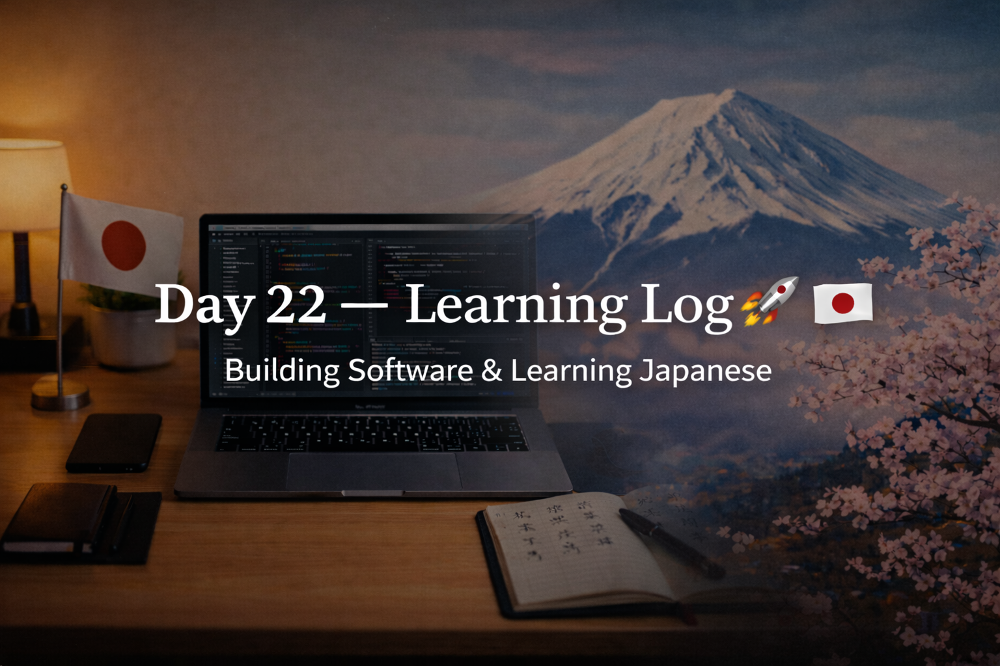

<!-- ========================= -->
<!-- DAY 22 — LEARNING LOG -->
<!-- ========================= -->

## 📅 Day 22 — Learning Log
**Focus:** Software Development × Japanese  
**Streak:** 22 days 🔥

---

## 💻 SOFTWARE DEVELOPMENT
- Started **DSA from scratch**
- Focused on understanding:
  - What DSA is
  - Why it matters for problem-solving and interviews
- Building mindset: **logic first, speed later**

---

## 🇯🇵 JAPANESE (KANJI)
- Studied **new kanji set** with focus on meaning + recall
- Covered concepts related to:
  - Making / building
  - Usage / service
  - Strength and thinking
  - Home, work, and daily life words
- Goal: recognize kanji in context, not isolated memorization

---

## 🌏 JAPAN × CAREER
- Learned about **伸びしろ (nobishiro)** — growth potential
- Japanese companies value:
  - Consistency
  - Willingness to learn
  - Attitude over raw skill (especially for juniors)
- Skills are trained later via **OJT**, mindset matters first

---

## 🧠 REFLECTION
Starting DSA feels intimidating, but today was about **foundations**, not mastery.  
Consistency is slowly compounding across software and Japanese.

---

## ⏭️ NEXT
- Continue DSA basics
- Maintain daily kanji rhythm
- Keep documenting progress

🔥 **Day 22 complete. Showing up matters.**
