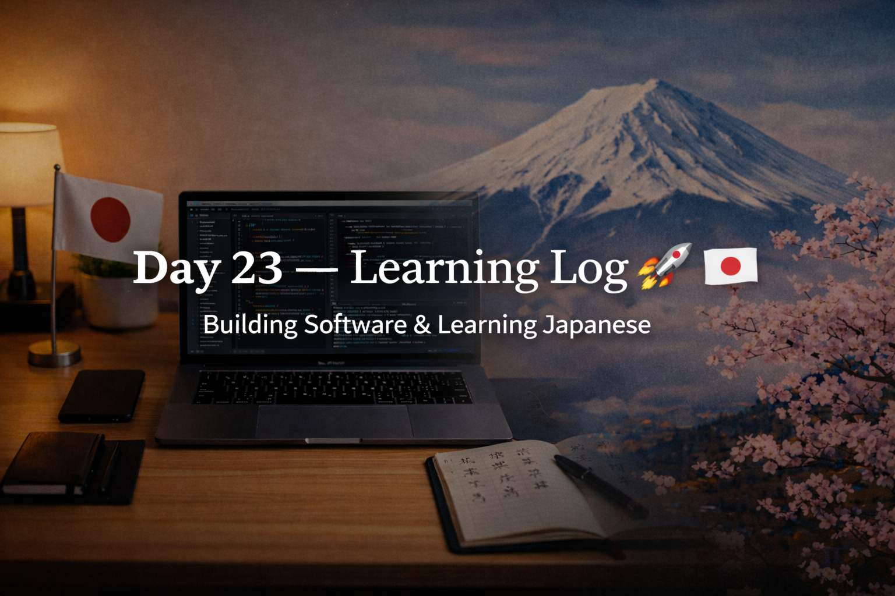

<!-- ===================== -->
<!-- 🌟 DAY 23 BANNER 🌟 -->
<!-- ===================== -->

---

# 🚀 Day 23 — Learning Log 📘🇯🇵  
📅 Date: Day 23  
🔥 Current Streak: 23 days  
🏆 Longest Streak: 23 days  

---

## 💻 Software Development

### 🧠 Programming Practice (C)
- Uploaded **3 new C programs** to `programming-practice`:
  - Linear search
  - Sum and average of array elements
  - Find maximum and minimum element in an array
- Strengthened understanding of:
  - Array traversal
  - Conditional logic
  - Step-by-step dry run
- Continued shifting mindset from **“just solving” → “thinking like DSA”**

📂 Repo (C Programs):  
👉 https://github.com/aryan-devv/programming-practice/tree/main/C

---

## 🇯🇵 Japanese Language — Kanji Revision

- Revised **3 Kanji** today:
  - 不 (negative, non-, bad)
  - 会 (meeting, association, meet)
  - 空 (empty, sky, void)
- Focused on:
  - Meaning clarity
  - Reading recall
  - Real-life usage awareness
- Detailed breakdown shared separately in Discord Kanji post

---

## 🎧 Japanese Listening
- Listening practice completed
- Focused on:
  - Understanding without translating word-by-word
  - Natural pacing
  - Context-based comprehension

---

## 🌏 Japan × Career Learning

### 🧠 空気を読む (くうきをよむ) — “Reading the Air”
In Japanese culture and workplaces:
- Understanding **unspoken context** is critical
- Silence often carries meaning
- Good professionals observe before acting
- Knowing *when* to speak matters as much as *what* to say

This mindset connects strongly with:
- Team dynamics in Japanese companies
- Respectful communication
- Thoughtful engineering decisions

---

## 🧠 Reflection
Another quiet but solid day.

- Code felt clearer
- Logic felt intentional
- Japanese study stayed consistent
- No rush, no pressure

Slow days still move the needle.

---

## 📌 Next Up (Day 24)
- Continue DSA foundations
- Maintain daily C practice
- Kanji recall + listening
- Protect the streak 🔥
