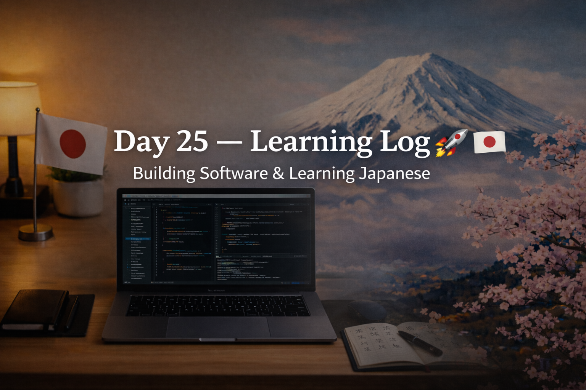

<!-- ===================== -->
<!-- 🌟 DAY 25 BANNER 🌟 -->
<!-- ===================== -->

---

# 🚀 Day 25 — Learning Log 📘🇯🇵  
📅 Date: Day 25  
🔥 Current Streak: 25 days  
🏆 Longest Streak: 25 days  

---

## 💻 Software Development

### 🧠 DSA Foundation — Day 1 (C Programming)

- Officially **entered Data Structures & Algorithms**
- Shifted mindset from:
  - “Just writing logic” → **thinking in patterns**
  - Code-first → **analysis-first**
- Learned and applied:
  - What DSA actually is (problem + constraints + efficiency)
  - Difference between:
    - Brute force vs optimized thinking
    - Normal logic problems vs DSA problems

### 📊 Time & Space Complexity (Basics)
- Understood **Big-O intuitively**:
  - O(1), O(n), O(n²)
- Analysed my own C programs:
  - Linear search → **O(n)**
  - Nested loops → **O(n²)**
- Practiced **looking at code and estimating complexity instantly**

### 🔁 DSA Practice (Depth > Quantity)
- Implemented **Linear Search (DSA-style)** in C:
  - Clear logic
  - Proper traversal
  - Comments explaining approach
  - Time complexity written explicitly
- Focused on **one problem done properly**, not many rushed ones

📂 Repo (C + DSA Practice):  
👉 https://github.com/aryan-devv/programming-practice/tree/main/C

---

## 🇯🇵 Japanese Language — Kanji Revision

- Revised **4 Kanji** today:
  - 花 (はな) — flower  
  - 業 (ギョウ / ゴウ) — business, vocation  
  - 市 (いち) — market, city  
  - 話 (はなす / はなし) — talk, conversation
- Focus areas:
  - Meaning recall
  - On/Kun reading confidence
  - Usage familiarity

---

## 🎧 Japanese Listening
- Listening practice completed
- Focused on:
  - Natural sentence flow
  - Catching familiar Kanji in speech
  - Understanding without translating word-by-word

---

## 🌏 Japan × Career Learning

### 🧠 Japanese Engineering Mindset — “Think Before You Act”
In Japanese work culture:
- Deep thinking **before execution** is respected
- Rushed action without clarity is avoided
- Efficiency comes from **planning**, not speed

This directly connects to DSA:
- Analyze before coding
- Understand constraints first
- Choose the simplest correct approach

DSA isn’t about clever tricks —  
it’s about **calm, structured thinking**.

---

## 🧠 Reflection
Day 25 was a **mental upgrade**.

- DSA finally made sense conceptually
- Coding felt slower — but clearer
- Confidence came from understanding, not guessing
- Japanese study stayed consistent alongside software

This is how real foundations are built.

---

## 📌 Next Up (Day 26)
- Continue DSA fundamentals
- More array-based thinking
- Kanji revision + listening
- Maintain streak 🔥
