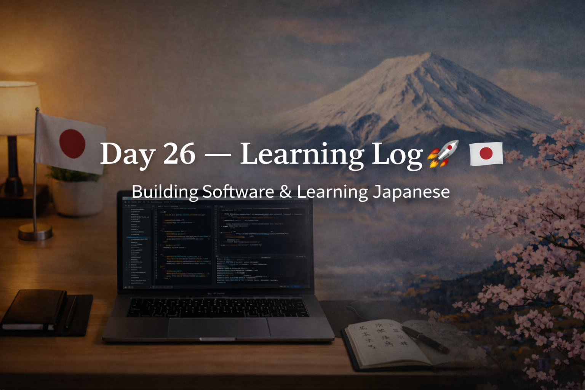

<!-- ===================== -->
<!-- 🌟 DAY 26 BANNER 🌟 -->
<!-- ===================== -->

---

# 🚀 Day 26 — Learning Log 📘🇯🇵  
📅 Date: Day 26  
🔥 Current Streak: 26 days  
🏆 Longest Streak: 26 days  

---

## 💻 Software Development

### 🧠 DSA Foundations — Day 1
- Officially started **DSA basics**
- Shifted mindset from:
  - “Just solving problems”
  → **Understanding patterns, constraints, and efficiency**
- Focused on:
  - What makes a problem *DSA-style*
  - Thinking before coding
  - Logic > syntax

This marks the **transition from C practice → algorithmic thinking**.

---

## 🇯🇵 Japanese Language — Kanji Revision

- Revised **9 Kanji** today
- Focused on:
  - Meaning recall
  - Usage awareness
  - Long-term retention
- Detailed Kanji explanations documented separately for **Discord Kanji posts**

---

## 🎧 Japanese Listening
- Listening practice completed
- Focused on:
  - Natural pacing
  - Sentence flow
  - Overall comprehension without translating every word

---

## 🌏 Japan × Career Learning

### 🧠 Why Japanese Engineers Value Fundamentals
In Japan, engineers are expected to:
- Master **basics deeply** before advancing
- Avoid shortcuts and flashy solutions
- Build trust through **consistent, correct fundamentals**

This directly aligns with:
- Starting DSA from the ground up
- Writing fewer but more reliable solutions
- Long-term growth over quick wins

---

## 🧠 Reflection
Day 26 felt like a **reset done right**.

- DSA journey started intentionally
- Kanji revision stayed consistent
- Listening kept the language alive
- No rush — just structured momentum

Strong foundations today = freedom later.

---

## 📌 Next Up (Day 27)
- Continue DSA basics
- Apply concepts to simple problems
- Daily Kanji + listening
- Maintain streak 🔥
