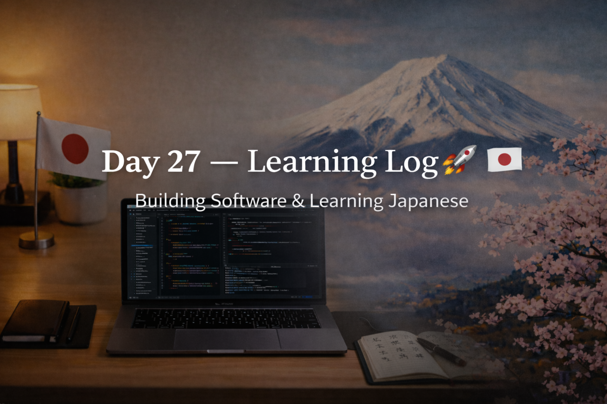

<!-- ===================== -->
<!-- 🌟 DAY 27 BANNER 🌟 -->
<!-- ===================== -->

---

# 🚀 Day 27 — Learning Log 📘🇯🇵  
📅 Date: Day 27  
🔥 Current Streak: 27 days  
🏆 Longest Streak: 27 days  

---

## 💻 Software Development

### 🧠 DSA Foundations (Slow & Correct Start)
- Continued **DSA from absolute basics**
- Focused on:
  - Understanding *why* an approach works
  - Thinking in terms of **steps, flow, and constraints**
  - Not rushing into complex structures
- Reinforced the idea that:
  - DSA = structured thinking, not just harder coding
  - Strong basics will make trees, graphs, DP easier later

Goal today was **clarity over speed**, not quantity.

---

## 🇯🇵 Japanese Language — Grammar Focus

### 🧩 Particles Practice
- Studied **Japanese particles** and their use in different situations
- Focused on understanding:
  - How particles change sentence meaning
  - Context-based usage instead of direct translation
- Emphasis on:
  - Reading comprehension
  - Natural sentence flow
  - Avoiding English-thinking while forming sentences

---

## 🎧 Japanese Listening
- Light listening exposure
- Focused on:
  - Recognizing particles in spoken Japanese
  - Identifying sentence structure
  - Understanding meaning without translating word-by-word

---

## 🌏 Japan × Career Learning

### 🧠 Why Japanese Engineers Care About “Context”
In Japanese communication (and workplaces):
- Meaning is often **implied**, not fully stated
- Context > direct explanation
- Listening carefully matters more than speaking fast

This connects directly to engineering because:
- Requirements are not always explicitly written
- You’re expected to:
  - Read between the lines
  - Ask thoughtful questions
  - Understand intent, not just instructions

Good engineers in Japan:
- Observe first
- Clarify politely
- Act precisely

---

## 🧠 Reflection
Day 27 was about **slowing down intentionally**.

- DSA felt calmer, not overwhelming
- Japanese felt more logical, not memorization-heavy
- Progress felt *stable*, not forced

Strong foundations are quiet — but powerful.

---

## 📌 Next Up (Day 28)
- Continue DSA basics with consistency
- More particle usage + sentence patterns
- Maintain streak 🔥
- Keep depth > speed mindset
