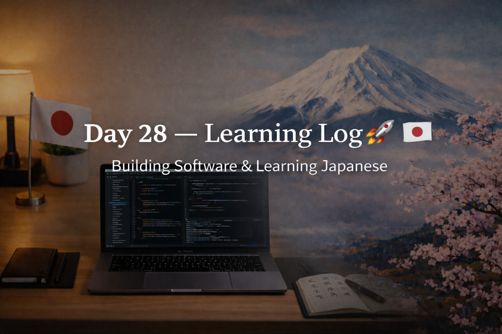

<!-- ===================== -->
<!-- 🌟 DAY 28 BANNER 🌟 -->
<!-- ===================== -->

---

# 🚀 Day 28 — Learning Log 📘🇯🇵  
📅 Date: Day 28  
🔥 Current Streak: 28 days  
🏆 Longest Streak: 28 days  

---

## 💻 Software Development

### 🧠 DSA Basics — Continuation
- Continued **DSA fundamentals**
- Focused on:
  - Understanding problems before coding
  - Identifying patterns instead of memorizing solutions
  - Strengthening array-based reasoning
- Goal today:
  - Build comfort with DSA thinking, not speed

Consistency > rushing into advanced topics.

---

## 🇯🇵 Japanese Language — Kanji Practice

- Practiced **10 Kanji** today
- Focused on:
  - Meaning clarity
  - Usage awareness
  - Long-term retention
- Detailed Kanji breakdown shared separately (Discord)

---

## 🎧 Japanese Listening
- Listening practice completed
- Focused on:
  - Natural sentence flow
  - Recognizing known particles & Kanji in speech

---

## 🌏 Japan × Career Learning

### 🧠 How Japanese Engineers Learn on the Job
In Japan, learning is often:
- **Observation-first** (watch seniors carefully)
- Asking fewer questions, but **very precise ones**
- Improving silently through repetition and correction

This explains why:
- Fundamentals are valued more than flashy skills
- Juniors are expected to grow steadily, not instantly

This matches perfectly with:
- DSA basics
- Daily repetition
- Long-term consistency

---

## 🧠 Reflection
Day 28 was about **depth and patience**.

- DSA progress feels slow but solid
- Japanese study stayed consistent
- Mindset is shifting toward long-term mastery

No shortcuts. No noise. Just alignment.

---

## 📌 Next Up (Day 29)
- Continue DSA basics
- More Kanji revision
- Listening + sentence awareness
- Maintain streak 🔥
