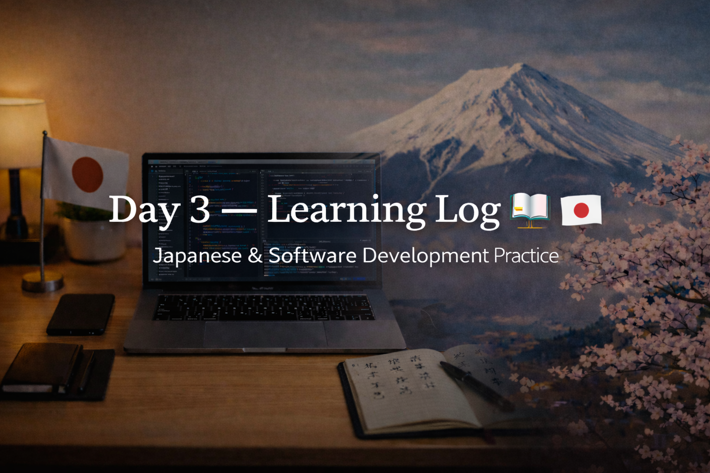
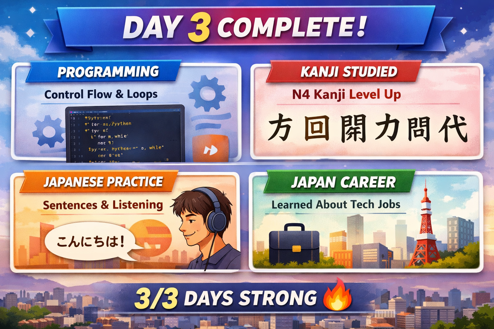

<!-- ===================== -->
<!-- 🌟 DAY 3 BANNER 🌟 -->
<!-- ===================== -->

---

# 🚀 Day 3 — Learning Log 🇯🇵💻  
📅 Date: Day 3  
🔥 Current Streak: 3 days  
🏁 Longest Streak: 3 days  

---

## 💻 Software Development

### 🧠 Programming Practice Repository
- Completed **Day 3 coding practice**
- Focused on **control flow and loops**
- Strengthened problem-solving logic transferable to **Java later**
- Uploaded all solutions to `programming-practice`
- Maintained clean, readable folder structure and commits

🔗 Repo: https://github.com/aryan-devv/programming-practice  

---

## 🇯🇵 Japanese Language — Kanji Study

Focused on **revision + expansion**, with emphasis on **usage and sentence formation**.

---

### 🔁 Kanji Revision (3)

#### 1️⃣ 民  
- **Meaning:** people, nation  
- **Readings:** min / tami  
- **Example:**  
  - 国民は大切です。  
    *(Kokumin wa taisetsu desu — The people of a country are important.)*

---

#### 2️⃣ 書  
- **Meaning:** write  
- **Readings:** sho / kaku  
- **Example:**  
  - 日本語を書きます。  
    *(Nihongo o kakimasu — I write Japanese.)*

---

#### 3️⃣ 北  
- **Meaning:** north  
- **Readings:** hoku / kita  
- **Example:**  
  - 北に山があります。  
    *(Kita ni yama ga arimasu — There is a mountain in the north.)*

---

### 🆕 New Kanji Learned (10)

#### 4️⃣ 方  
- **Meaning:** direction, person, way  
- **Readings:** hō / kata  
- **Example:**  
  - あの方は先生です。  
    *(Ano kata wa sensei desu — That person is a teacher.)*

---

#### 5️⃣ 回  
- **Meaning:** times, round  
- **Readings:** kai / mawaru / mawasu  
- **Example:**  
  - 三回食べます。  
    *(San-kai tabemasu — I eat three times.)*

---

#### 6️⃣ 場  
- **Meaning:** place, location  
- **Readings:** jō / ba  
- **Example:**  
  - ここは静かな場所です。  
    *(Koko wa shizuka na basho desu — This is a quiet place.)*

---

#### 7️⃣ 員  
- **Meaning:** member, employee  
- **Readings:** in  
- **Example:**  
  - 会社員です。  
    *(Kaishain desu — I am a company employee.)*

---

#### 8️⃣ 開  
- **Meaning:** open, unfold  
- **Readings:** kai / hiraku / akeru  
- **Example:**  
  - ドアを開けます。  
    *(Doa o akemasu — I open the door.)*

---

#### 9️⃣ 力  
- **Meaning:** power, strength  
- **Readings:** ryoku / riki / chikara  
- **Example:**  
  - 力が必要です。  
    *(Chikara ga hitsuyō desu — Strength is necessary.)*

---

#### 🔟 問  
- **Meaning:** question, ask  
- **Readings:** mon / toi / tō  
- **Example:**  
  - 質問があります。  
    *(Shitsumon ga arimasu — I have a question.)*

---

#### 1️⃣1️⃣ 代  
- **Meaning:** replace, generation  
- **Readings:** dai / tai / kawaru / kaeru  
- **Example:**  
  - 私が代わります。  
    *(Watashi ga kawarimasu — I will replace you.)*

---

#### 1️⃣2️⃣ 明  
- **Meaning:** bright, clear  
- **Readings:** mei / myō / akarui  
- **Example:**  
  - 明るい部屋です。  
    *(Akarui heya desu — It is a bright room.)*

---

#### 1️⃣3️⃣ 動  
- **Meaning:** move, motion  
- **Readings:** dō / ugoku / ugokasu  
- **Example:**  
  - 車が動きます。  
    *(Kuruma ga ugokimasu — The car moves.)*

---

## ✍️ Output Practice
- Formed Japanese sentences for:
  - Greeting people
  - Ordering food
  - Introducing myself
  - Asking and answering basic questions
- Focused on **natural usage and confidence**, not memorization

---

## 📘 Grammar
- Revised core particles:
  - は / が / を / に
- Applied grammar directly in sentence formation
- Reinforced correct word order (verb at the end)

---

## 🎧 Japanese Listening
- Completed **Japanese vlog listening session**
- Focused on:
  - Natural pronunciation
  - Intonation
  - Sentence rhythm
- Goal: comprehension without subtitles

---

## 🌐 Japan / Career Learning
- Studied **software roles in Japan**:
  - Backend Engineer
  - Frontend Engineer
  - System Engineer (SE)
- Understood why companies value:
  - Consistency
  - Documentation
  - GitHub activity

---

## 🤝 Networking
- Connected with **one Japanese professional**
- Interaction kept polite, simple, and respectful

---

## 🖼️ Day 3 Milestone
*(Visual snapshot of the day’s overall progress)*

---

## 🧠 Reflection
Day 3 was about **solidifying momentum**:
- Programming logic felt sharper
- Japanese output felt more natural
- Listening improved rhythm and flow
- GitHub activity reflected real consistency

This progress feels **earned and sustainable**.

---

## 📌 Next Up (Day 4)
- More programming practice
- Continued Kanji expansion + usage
- Listening with speaking intent
- Maintain streak 🔥
