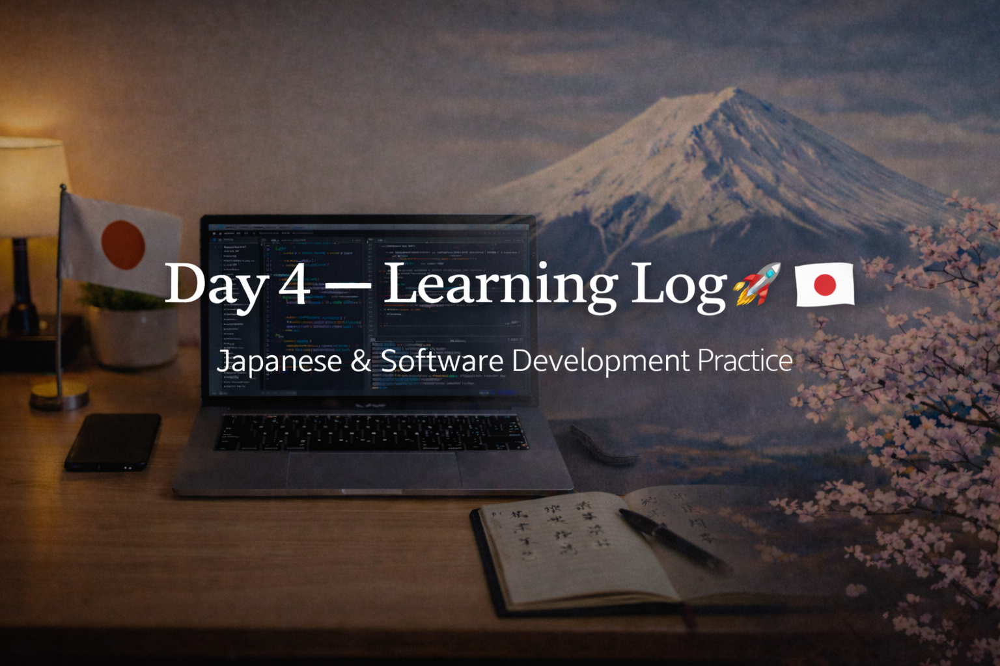

<!-- ===================== -->
<!-- 🌟 DAY 4 BANNER 🌟 -->
<!-- ===================== -->

---

# 🚀 Day 4 — Learning Log 🇯🇵💻  
📅 Date: Day 4  
🔥 Current Streak: 4 days  
🏁 Longest Streak: 4 days  

---

## 💻 Software Development

### 🧠 Mini Project — CLI Todo Manager
- Built a **menu-driven CLI Todo Manager**
- Implemented core features:
  - Add tasks
  - View tasks
  - Mark tasks as completed
  - Delete tasks
  - Exit program safely
- Used:
  - Functions
  - Loops
  - Conditionals
  - Lists / dictionaries
- Added proper **README.md** and **.gitignore**
- Focused on clean structure and reusability

🔗 Repo:  
https://github.com/aryan-devv/programming-practice  

---

## 🇯🇵 Japanese Language — Daily Practice

Focused on **revision, expansion, and real usage**.

---

### 🔁 Kanji Revision (7)
- Previously learned Kanji revised for recall and confidence
- Focused on meaning + readings + usage

---

### 🆕 New Kanji Learned (10)
- Learned 10 new Kanji
- Focused on:
  - Meaning
  - Readings
  - Natural usage in sentences

---

## ✍️ Speaking & Writing Practice — DONE

Practiced forming natural Japanese sentences related to daily life and learning.

### 🗣️ / ✍️ Practice Sentences

- 私は毎日プログラミングを勉強しています。  
  *(Watashi wa mainichi puroguramingu o benkyō shite imasu — I study programming every day.)*

- 今日はToDoアプリを作りました。  
  *(Kyō wa ToDo apuri o tsukurimashita — Today I made a Todo app.)*

- 日本で働きたいです。  
  *(Nihon de hatarakitai desu — I want to work in Japan.)*

- 少しずつ日本語が分かるようになりました。  
  *(Sukoshi zutsu Nihongo ga wakaru yō ni narimashita — I am slowly starting to understand Japanese.)*

- 毎日少しでも勉強することが大切です。  
  *(Mainichi sukoshi demo benkyō suru koto ga taisetsu desu — Studying a little every day is important.)*

---

## 🎧 Japanese Listening
- Completed **Japanese listening practice**
- Used natural content (vlog / daily-life style)
- Focused on:
  - Flow
  - Pronunciation
  - Sentence endings
- Goal: comfort with real Japanese audio

---

## 🌐 Japan / Career Learning
- Learned how software roles work in Japan
- Understood:
  - Why **System Engineers** are important
  - Why companies value **consistency, documentation, and reliability**
- Gained clarity on long-term career alignment with Japan

---

## 🤝 Networking
- Connected with **one Japanese professional**
- Interaction kept polite and respectful
- Focused on long-term relationship building

---

## 🧠 Reflection
Day 4 felt like a **shift from practice to building**.

- Built a complete CLI system
- Used functions in a real context
- Japanese practice felt more expressive
- Listening and career learning stayed consistent
- Final exams are approaching, but I’m still showing up daily and balancing syllabus study with long-term skill building

Progress feels **earned, disciplined, and intentional**.

---

## 📌 Next Up (Day 5)
- Improve or extend the Todo Manager
- More Kanji + output
- Listening with higher difficulty
- Maintain streak 🔥
