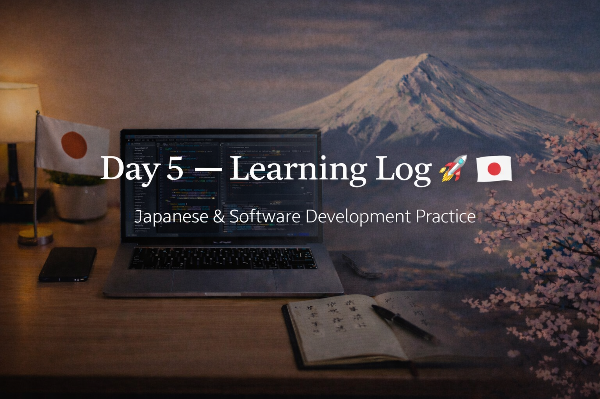

<!-- ===================== -->
<!-- 🌟 DAY 5 BANNER 🌟 -->
<!-- ===================== -->

---

# 🚀 Day 5 — Learning Log 🇯🇵💻  
📅 Date: Day 5  
🔥 Current Streak: 5 days  
🏁 Longest Streak: 5 days  

---

## 💻 Software Development

### 🧠 Code Review & Refinement
- Reviewed **CLI Todo Manager** mini project
- Improved:
  - Variable naming for clarity
  - Function separation for readability
  - README.md explanation for better understanding
- Added clear comments explaining logic (future-proofing for myself and readers)
- Focused on **code quality over new features**

🔗 Repo:  
https://github.com/aryan-devv/programming-practice  

---

## 🇯🇵 Japanese Language — Daily Practice

Focused on **maintenance and consistency** during exam preparation.

---

### 🔁 Kanji Revision (18)
- Revised **18 previously learned Kanji**
- Focused on:
  - Meaning recall
  - Readings
  - Recognition in context
- Prioritized retention over learning new characters

---

## 🎧 Japanese Listening
- Completed **Japanese listening practice**
- Used natural content (vlog / daily-life audio)
- Focused on:
  - Sound familiarity
  - Sentence endings
  - Overall flow
- Goal: stay comfortable with real Japanese during busy days

---

## 🌐 Japan / Career Learning
- Learned about the **Shinsotsu (new graduate) hiring system** in Japan
- Understood that companies value:
  - Potential
  - Consistency
  - Long-term growth mindset
- Realized why steady effort and documentation matter more than speed

---

## 🤝 Networking
- Maintained consistency with professional networking
- Focused on respectful, long-term connections

---

## 🧠 Reflection
Final exams are approaching, so today was about **showing up without overloading**.

- Focused on refining existing work instead of starting something new
- Maintained Japanese listening and Kanji revision
- Kept the learning streak alive despite academic pressure

Consistency today mattered more than intensity.

---

## 📌 Next Up (Day 6)
- Light programming or revision (exam-aware)
- Continued Kanji revision
- Listening practice
- Maintain streak 🔥
