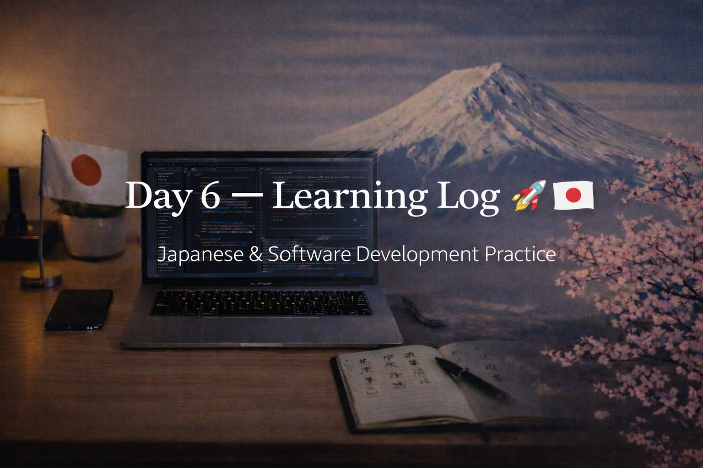

<!-- ===================== -->
<!-- 🌟 DAY 6 BANNER 🌟 -->
<!-- ===================== -->

---

# 🚀 Day 6 — Learning Log 🇯🇵💻  
📅 Date: Day 6  
🔥 Current Streak: 6 days  
🏁 Longest Streak: 6 days  

---

## 💻 Software Development

### 🧠 Code Review & Refinement
- Reviewed **CLI Todo Manager** project
- Focused on **code quality over new features**
- Improved:
  - Variable naming for clarity
  - Function responsibility separation
  - Inline comments for logic explanation
- Optimized for:
  - Readability
  - Maintainability
  - Recruiter / future-self understanding

📂 Repo:  
https://github.com/aryan-devv/programming-practice  

> Today’s coding focus was **thinking like an engineer**, not just writing code.

---

## 🇯🇵 Japanese Language — Daily Practice

### 🔁 Kanji Revision (16)
- Revised **16 previously learned Kanji**
- Focused on:
  - Meaning recall
  - Onyomi & Kunyomi association
  - Faster recognition in context

Kanji revised covered themes like:
- Food & actions
- Direction & movement
- Change & substitution
- Space, logic, body, and reality

---

## ✍️ Speaking & Writing Practice — DONE

Practiced forming natural Japanese sentences with confidence.

### 🗣️ / ✍️ Practice Sentences

- 毎日日本語を勉強しています。  
  *(Mainichi Nihongo o benkyō shite imasu — I study Japanese every day.)*

- 少しずつ上達しています。  
  *(Sukoshi zutsu jōtatsu shite imasu — I am improving little by little.)*

- 日本で働くことが目標です。  
  *(Nihon de hataraku koto ga mokuhyō desu — Working in Japan is my goal.)*

---

## 🎧 Japanese Listening
- Completed **listening practice**
- Used natural Japanese audio
- Focused on:
  - Flow and rhythm
  - Familiar Kanji appearing in speech
  - Understanding without translating every word

---

## 🌐 Japan × Career Learning
- Japanese companies prefer **long-term employment** because they invest heavily in training and value loyalty, stability, and gradual growth over frequent job switching.

---

## 🤝 Networking
- Maintained ongoing connections
- Focused on:
  - Polite presence
  - Long-term relationship building
  - No pitching, only genuine interest

---

## 🧠 Reflection
Day 6 was about **refinement, not expansion**.

- Code quality improved
- Japanese recall felt smoother
- Career understanding deepened
- Even with exams, consistency stayed intact

Showing up > doing everything.

---

## 📌 Next Up (Day 7)
- Light programming (exam-friendly)
- Continued Kanji revision
- Listening with higher difficulty
- Maintain streak 🔥
