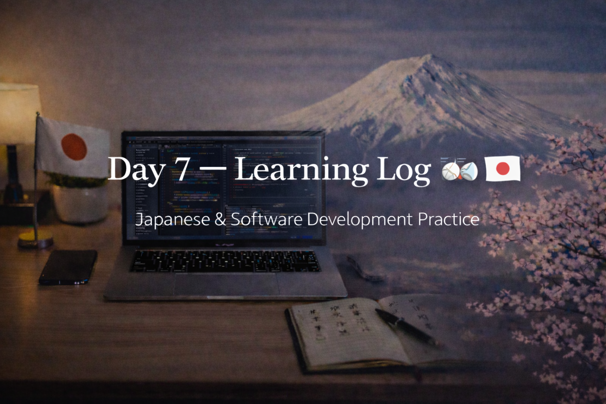

<!-- ===================== -->
<!-- 🌟 DAY 7 BANNER 🌟 -->
<!-- ===================== -->

---

# 🚀 Day 7 — Learning Log 🇯🇵💻  
📅 Date: Day 7  
🔥 Current Streak: 7 days  
🏁 Longest Streak: 7 days  

---

## 💻 Software Development

### 🧠 Code Review & System Thinking
- Continued working on **CLI Todo Manager**
- Added **test scenarios as comments** to think through edge cases
- Focused on:
  - System behavior
  - Failure scenarios
  - User input safety
- Practiced thinking like an engineer instead of adding features

📂 Repo:  
https://github.com/aryan-devv/programming-practice  

> Today’s focus was on **how the system behaves**, not how big it looks.

---

## 🇯🇵 Japanese Language — Daily Practice

### 🔁 Kanji Revision
- Revised **15 previously learned Kanji**
- Focused on:
  - Recall speed
  - Meaning association
  - Strengthening foundation during exams
- Detailed Kanji breakdown documented separately (Discord)

---

## ✍️ Speaking & Writing Practice — DONE
- Practiced forming simple, natural Japanese sentences
- Focused on clarity and confidence, not complexity

---

## 🎧 Japanese Listening
- Completed **listening practice**
- Used natural Japanese audio
- Focused on:
  - Flow
  - Intonation
  - Familiar vocabulary recognition

---

## 🌐 Japan × Career Learning
- Learned about **Hō–Ren–Sō (報・連・相)** — the Japanese workplace principle of reporting, communication, and consultation
- Understood how steady communication builds trust and prevents surprises in Japanese companies

---

## 🤝 Networking
- Maintained consistency with professional networking
- Focused on respectful, long-term connections without pitching

---

## 🧠 Reflection
Day 7 was about **discipline during pressure**.

- Exams are ongoing
- Learning pace adjusted, not stopped
- Software, Japanese, and career learning stayed connected

Consistency stayed intact — and that matters most.

---

## 📌 Next Up (Day 8)
- Light programming or revision
- Continued Kanji revision
- Listening with higher difficulty
- Maintain streak 🔥
