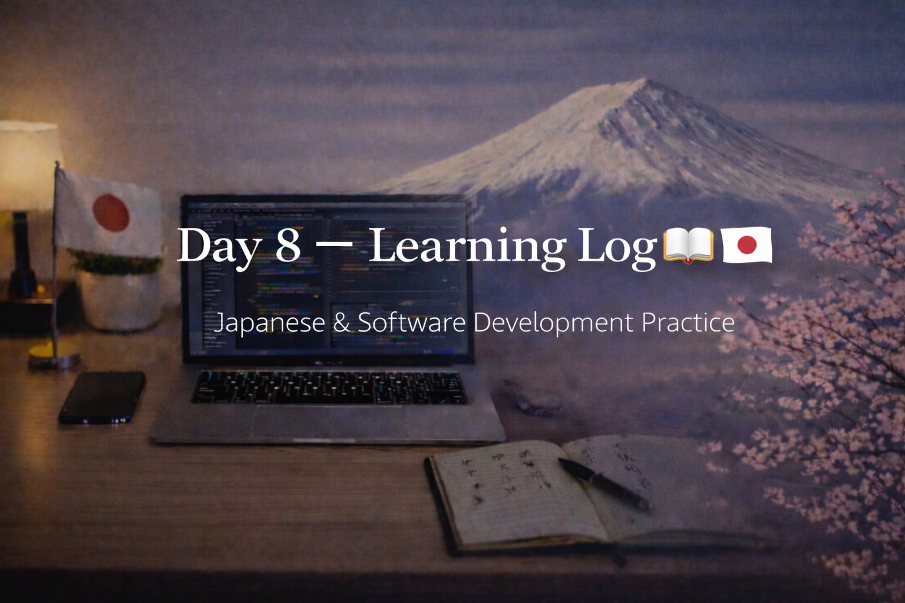

<!-- ===================== -->
<!-- 🌟 DAY 8 BANNER 🌟 -->
<!-- ===================== -->

---

# 🚀 Day 8 — Learning Log 🇯🇵💻  
📅 Date: Day 8  
🔥 Current Streak: 8 days  
🏁 Longest Streak: 8 days  

---

## 💻 Software Development

### 🧠 Light Programming Session
- Completed a **45-minute focused review session**
- Went through everything learned so far:
  - Programming fundamentals
  - Control flow & logic
  - Functions and structure
  - CLI project concepts
- Focused on **consolidation**, not adding new topics
- Goal was clarity and confidence, not speed

Today was about **strengthening the base**, not building on top of shaky ground.

---

## 🇯🇵 Japanese Language — Daily Practice

### 🔁 Kanji Revision
- Revised **10 Kanji**
- Focused on:
  - Meaning recall
  - Reading familiarity
  - Simple usage understanding
- Detailed Kanji breakdown documented separately (Discord)

---

### ✍️ Speaking & Writing — DONE
- Practiced forming short, natural Japanese sentences
- Focused on expressing thoughts clearly using known vocabulary

---

### 🎧 Listening
- Completed Japanese listening practice
- Used natural content
- Focused on:
  - Flow
  - Intonation
  - Recognizing familiar words without translating everything

---

## 🗾 Japan × Career Learning
- Learned that Japanese companies value **continuous improvement and learnability**
- Understood that steady growth and openness to feedback matter more than knowing everything upfront

---

## 🤝 Networking
- Maintained consistency with professional connections
- Focused on respectful, long-term relationship building

---

## 🧠 Reflection
Day 8 was a **calm but important day**.

- Reviewed instead of rushing ahead
- Reinforced confidence in what I already know
- Kept Japanese and career learning active
- Stayed consistent even during exams

Not every day needs intensity.
Some days are about **stability**.

---

## 📌 Next Up (Day 9)
- Slightly increase programming depth
- Continue Kanji revision + light expansion
- Listening with higher difficulty
- Maintain streak 🔥
