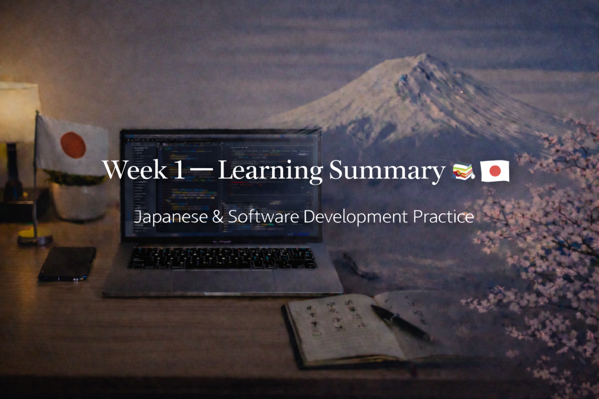

<!-- ===================== -->
<!-- 🌟 WEEK 1 BANNER 🌟 -->
<!-- ===================== -->

---

# 🚀 Week 1 — Learning Log 🇯🇵💻  
📅 Duration: Day 1 → Day 7  
🔥 Current Streak: 7 days  
🏆 Longest Streak: 7 days  

---

## 💻 Software Development — Weekly Progress

This week was about **building fundamentals + shipping real work**, not rushing.

### 🧠 Programming Practice
- Practiced Python fundamentals daily:
  - Variables, conditions, loops
  - Functions and control flow
  - Lists & dictionaries
- Focused on **clean logic**, not shortcuts
- Maintained consistency even during exams

### 🧩 Mini Project — CLI Todo Manager
- Designed and built a **menu-driven CLI Todo Manager**
- Implemented:
  - Add / view / complete / delete tasks
  - Duplicate task prevention
  - Auto task ID management
  - Safer input handling
- Refactored code for:
  - Better function separation
  - Clear variable names
  - Readable comments (future-proofing)
- Added clean **README.md** and `.gitignore`

📂 Repo:  
👉 https://github.com/aryan-devv/programming-practice  

This project marked the shift from *practice problems* → *system thinking*.

---

## 🇯🇵 Japanese Language — Weekly Progress

This week focused on **daily exposure + output**, not perfection.

### 🈶 Kanji Practice
- Revised **N5 Kanji thoroughly**
- Began revising and touching **N4-level Kanji**
- Total Kanji revised/learned across the week: **high-volume, daily consistency**
- Focused on:
  - Meaning
  - Readings
  - Real usage (not rote memorization)

*(Detailed Kanji breakdowns documented on Discord to avoid overload here)*

---

### ✍️ Speaking & Writing
- Practiced forming natural Japanese sentences:
  - Self-introduction
  - Daily activities
  - Goals related to study & work
- Shifted mindset from “translation” → **expression**

---

### 🎧 Listening
- Daily listening using:
  - Japanese vlogs
  - Natural, real-life speech
- Focused on:
  - Rhythm
  - Intonation
  - Understanding without subtitles

---

## 🗾 Japan × Career Learning — Week 1

Learned how **Japanese work culture actually functions**, not stereotypes.

Key topics explored:
- Why Japanese companies value **consistency**
- Importance of **GitHub activity & documentation**
- System Engineer (SE) role in Japan
- Why **long-term employment** is preferred
- What **Shinsotsu (new graduate hiring)** means
- How Japanese resumes differ from Western ones

This helped align **how I study today** with **how Japan hires tomorrow**.

---

## 🤝 Networking
- Connected with **Japanese professionals on LinkedIn**
- No pitching, no asking — just respectful connections
- Focus: long-term relationship building

---

## 🧠 Weekly Reflection

Week 1 proved something important:

- Consistency > motivation  
- Small daily actions compound fast  
- Exams didn’t stop progress — discipline carried it  
- Japanese no longer feels “foreign”, it feels **familiar**  
- Programming shifted from syntax → **thinking**

This week built the **foundation**.  
The next weeks will build **momentum**.

---

## 📌 Next Week (Week 2)
- Extend projects or start a new mini system
- Push deeper into N4 Kanji + grammar
- Improve listening difficulty
- Stay visible on GitHub & LinkedIn
- Maintain streak 🔥

---

> *Seven days down. This is no longer a challenge — it’s a system.* 🚀🇯🇵💻
