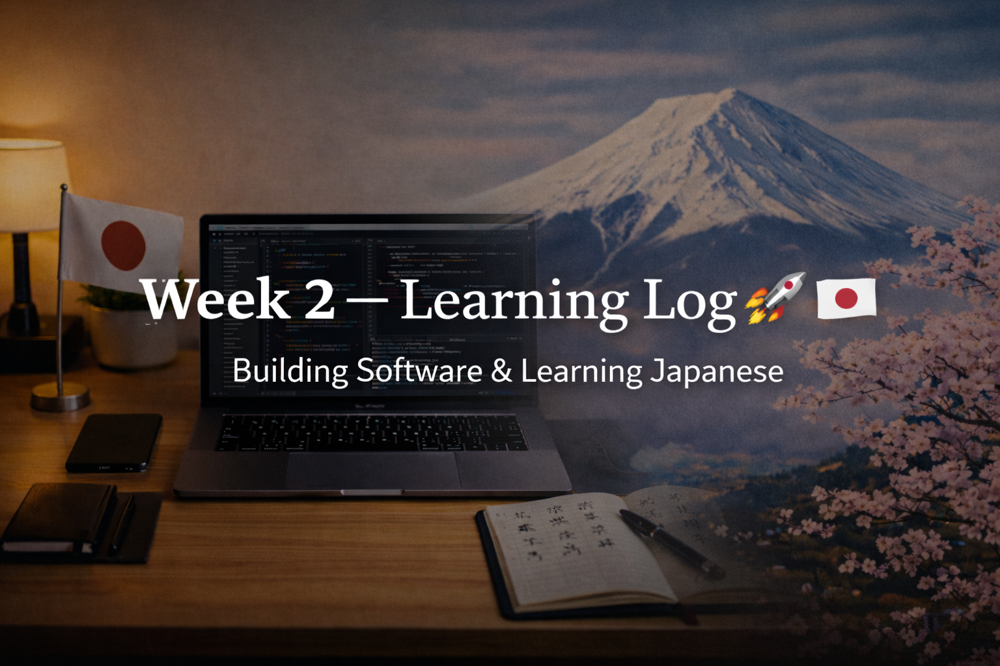

<!-- ===================== -->
<!-- 🌟 WEEK 2 BANNER 🌟 -->
<!-- ===================== -->

---

# 📅 Week 2 — Learning Log 🇯🇵💻  
🔥 Current Streak: 14 days  
🏁 Longest Streak: 14 days  

---

## 💻 Software Development

This week was about **foundations, clarity, and exam alignment**.

- Revised **C Programming (college syllabus)** in depth  
- Focused on:
  - Control flow
  - Functions
  - Logic building
  - Exam-oriented understanding
- Studied **programming language types**:
  - Low-level vs high-level languages
  - Human-readable languages
- Learned about:
  - **Linux OS**
  - Advantages of Linux
  - Different Linux distributions
- Explored **web hosting fundamentals**:
  - GitHub Pages
  - Custom domains
- Learned **AWS basics**:
  - What AWS is
  - Why cloud matters
- Updated **GitHub Profile README**:
  - Added GitHub stats
  - Added most-used languages
- Balanced **exam preparation + self-learning** without breaking consistency

---

## 🇯🇵 Japanese Language Learning

Focus this week: **revision, recall, and stability**.

- Revised Kanji daily (N5 → N4 level range)
- Focused on:
  - Meaning
  - Readings
  - Usage (not rote memorization)
- Strengthened recall through repetition
- Continued **listening practice** using natural Japanese content
- Built confidence in recognizing Kanji in context

*(Detailed Kanji breakdowns shared on Discord)*

---

## 🗾 Japan × Career Learning

Learned one focused concept per day:

- Long-term employment mindset in Japan
- Loyalty and stability in Japanese companies
- On-the-job training (OJT) culture
- Respect for juniors and structured growth
- Discipline and consistency in workplaces
- Importance of fundamentals over speed

Key takeaway:
Japanese careers reward **patience, reliability, and steady growth**.

---

## 🤝 Networking

- Continued connecting with Japanese professionals
- Focused on:
  - Polite communication
  - No pitching
  - Long-term mindset

---

## 🧠 Reflection

Week 2 wasn’t flashy — it was **real**.

- Exams were close, but consistency didn’t break
- Learning slowed down intentionally, not stopped
- Foundations feel stronger
- Discipline feels natural now

This is how long-term progress is built.

---

## 📌 Next Week (Week 3)
- Resume normal software pace after exams
- Deeper Linux + tooling
- Continued Kanji revision + listening
- More Japan × career insights
- Maintain streak 🔥

Week 2 complete ✅  
On to Week 3 🚀
