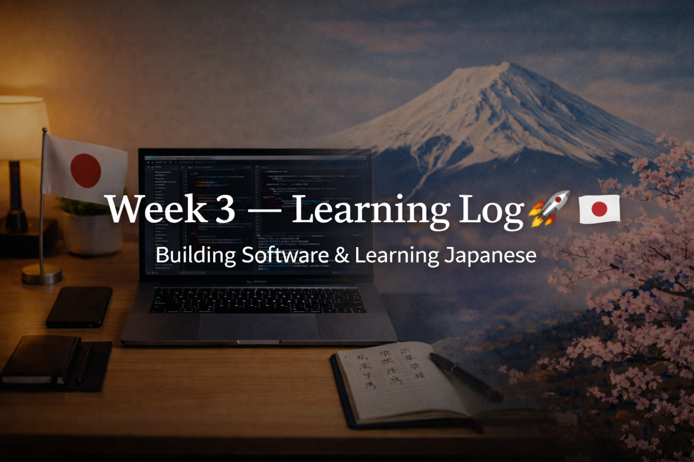

<!-- ===================== WEEK 3 BANNER ===================== -->
<!-- WEEK 3 — LEARNING LOG -->

<!-- ========================================================= -->

# 📘 WEEK 3 — Learning Log 🇯🇵💻  
**Focus:** Programming Fundamentals × Japanese Consistency  
**Streak:** 21 Days 🔥  

---

## 🧠 WEEK OVERVIEW
Week 3 was about **leveling up logic**, **thinking like a programmer**, and **building momentum**.  
Instead of rushing new topics, the focus stayed on **clarity, correctness, and repetition**.

---

## 💻 SOFTWARE DEVELOPMENT
This week was heavily focused on **C programming fundamentals** and logical problem-solving.

**What I worked on:**
- Practiced exam-oriented C programming questions
- Implemented multiple logic-based programs:
  - Second smallest element in array
  - String palindrome check
  - Digit frequency counter
- Ran and verified programs on VS Code
- Started thinking from a **DSA mindset**, not just syntax
- Improved confidence in writing clean, correct logic

**Repository:**
https://github.com/aryan-devv/programming-practice

---

## 🇯🇵 JAPANESE (KANJI + LANGUAGE)
Consistency stayed strong with **daily Kanji revision**.

**Focus areas:**
- Meanings + readings (Onyomi / Kunyomi)
- High-frequency Kanji used in daily and professional contexts
- Reinforcing recall through repetition instead of overload

This week emphasized **retention over volume**.

---

## 🌏 JAPAN × CAREER LEARNING
This week’s Japan-related learning focused on **how professionals grow in Japan**:
- Skill is respected, but **attitude and consistency matter more**
- Repetition and patience are valued over shortcuts
- Growth is expected to be **steady, not flashy**

---

## 📈 KEY TAKEAWAYS
- Logic improves when you **slow down and verify**
- Consistency compounds faster than motivation
- Small programs daily > big plans someday
- Discipline is becoming a habit now

---

## 🧠 REFLECTION
Week 3 felt quieter — and that’s a good sign.  
Real progress often looks boring from the outside.

Still showing up.  
Still building.

---

## ▶️ NEXT WEEK (WEEK 4)
- More DSA-oriented thinking
- Deeper C programming logic
- Continued Kanji consistency
- No breaks, no excuses

---

🔥 **Week 3 Complete**  
Consistency remains undefeated.
